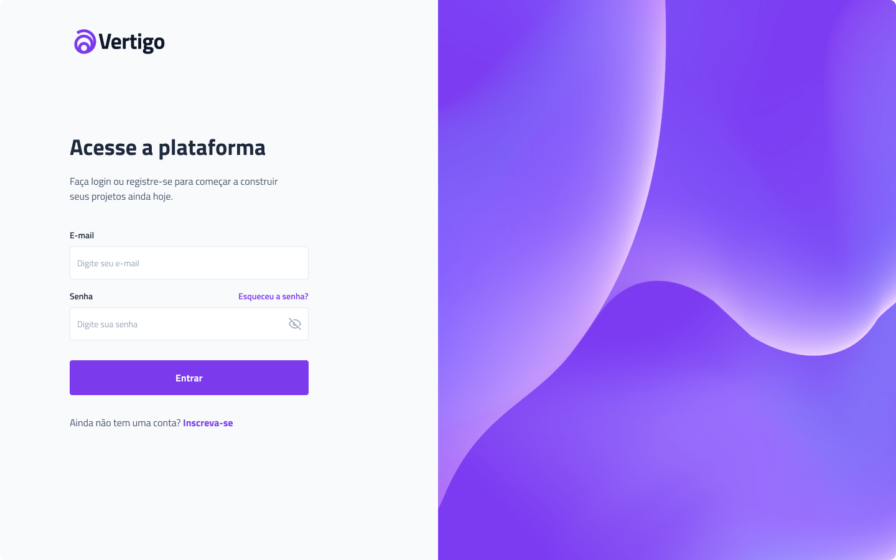

<h1 align="center">Recriação de uma tela de Login</h1>

  

## 🚀 Tecnologias

Esse projeto foi desenvolvido com as seguintes tecnologias:

- HTML e CSS
- JavaScript
- Git e Github
- Figma
 
## ✏️ Layout

🔗 Link-Figma: https://www.figma.com/file/qXOCVPWKt0iyEHP4XLB7LO/%23boracodar---Desafio-11-(Community)?node-id=11%3A33&t=hxgjmm6SvHX8TzcR-1

---

🌌 By Lucas Loopst
